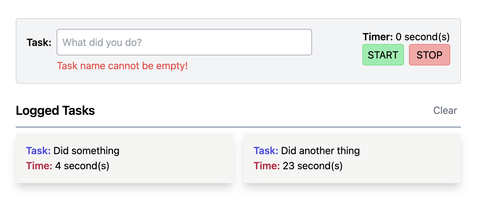

# Task Logger

## Description
A simple task logger that measures how many seconds has elapsed for each task

## Tech Stack
- Reactjs
- React Redux
- TailwindCSS
- Vite

## Screenshot

## Usage
1. Clone the repository
2. Install dependencies: `pnpm install`
3. Run the dev environment: `pnpm run dev`